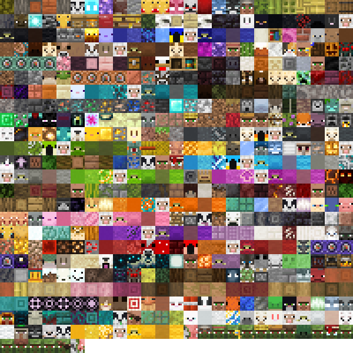

# Miniblocks

Adds 600+ Miniblocks to Minecraft

Covers all full minecraft blocks and all mob and animal heads

## Obtaining
Currently the miniblocks are only accessible via `/function miniblocks:give/<name>` or as a loot table reward

## Planned Features
- Survival Obtainability
- Novel blocks for decoration

## Mosaic of all Miniblocks (from the front)
